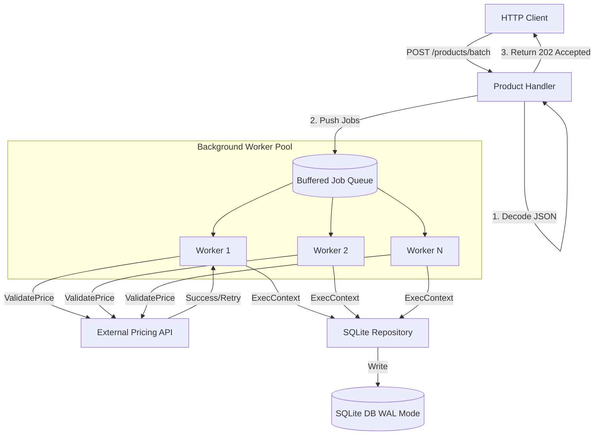

# 🚀 Golang REST Service with Concurrency & Worker Pool

[](https://golang.org/)
[](https://blog.cleancoder.com/uncle-bob/2012/08/13/the-clean-architecture.html)
[](http://localhost:8080/metrics)

A production-oriented Go backend service demonstrating concurrent processing, structured architecture, and lifecycle management using idiomatic Go patterns.

---

## 🎯 Purpose
This project was built to explore Go in the context of real-world backend engineering, focusing on:
- **Concurrent request processing** using goroutines and worker pools.
- **Structured service architecture** (Handlers, Services, Repositories).
- **Context propagation** and request lifecycle management.
- **Graceful shutdown** and production readiness considerations.

> [!NOTE]
> While my background is primarily in **Java-based distributed systems**, this project reflects how I apply those same architectural principles—scalability, resilience, and observability—within the Go ecosystem.

---

## 🏛️ Architecture & Request Flow
The service is organized into layered components to ensure separation of concerns and testability.



### 📁 Directory Layout
The codebase is modularized using standard Go layout patterns:
- [cmd/server/main.go](./cmd/server/main.go): The application entry point, setup of routing, dependency injection, and signal handling.
- [internal/config/config.go](./internal/config/config.go): Config parsing with default values and support for local `.env` variables.
- [internal/handlers/](./internal/handlers): HTTP Handlers implementing the request-response layer:
  - [product.go](./internal/handlers/product.go): Directs product management routes including single and batch asynchronous inserts.
  - [health.go](./internal/handlers/health.go): Handles liveness/readiness status endpoints.
- [internal/services/](./internal/services): Core business logic orchestrating operations between handlers, external clients, and repositories.
- [internal/repository/](./internal/repository): Data access layer implementing storage contracts:
  - [sqlite_product_repository.go](./internal/repository/sqlite_product_repository.go): Handles product persistence using SQLite with context propagation.
- [internal/client/pricing_client.go](./internal/client/pricing_client.go): Simulation client for communicating with an external pricing validation system.
- [pkg/worker/pool.go](./pkg/worker/pool.go): Thread-safe background worker pool implementation that consumes concurrent jobs.
- [pkg/middleware/](./pkg/middleware): Request filter middleware including Prometheus metrics collection and IP-based rate limiting.

---

## 🧠 Concurrency Model (The Differentiator)
This service avoids spawning unbounded goroutines per request. Instead, it implements a managed **Worker Pool** pattern:
- **Controlled Throughput**: Incoming tasks are dispatched to a job queue, preventing resource exhaustion. Refer to the pool implementation in [pkg/worker/pool.go](./pkg/worker/pool.go).
- **Parallel Processing**: A fixed pool of worker goroutines processes jobs in parallel.
- **Async Batching**: The `POST /products/batch` endpoint defined in [internal/handlers/product.go](./internal/handlers/product.go) offloads heavy write operations, returning `202 Accepted` and running the validation and persistence asynchronously in the worker pool.
- **Backpressure**: Buffered channels handle burst workloads without dropping requests.

---

## 🛡️ Resilience & Production Readiness
This project incorporates several patterns critical for long-running, distributed services:

- **External System Resilience**: The `PricingClient` in [internal/client/pricing_client.go](./internal/client/pricing_client.go) implements **Retries with Exponential Backoff** and **Jitter** to handle flaky dependencies safely.
- **Observability**: Exposes **Prometheus Metrics** (`/metrics`) via [pkg/middleware/](./pkg/middleware) for latency/throughput tracking and uses structured JSON logging (`log/slog`) for ELK/Loki ingestion.
- **Graceful Shutdown**: Listens for `SIGTERM/SIGINT` in [cmd/server/main.go](./cmd/server/main.go) to drain in-flight requests and safely stop the worker pool with **zero data loss**.
- **Context Propagation**: Contexts flow through every layer to enable **Cascading Cancellations** if a client disconnects.
- **Rate Limiting**: IP-based rate limiting using a token bucket algorithm to prevent abuse, configured via [pkg/middleware/](./pkg/middleware).

---

## 🔍 Technical Implementation Highlights

<details>
<summary><b>1. Managed Worker Pool Logic</b></summary>

```go
// Managed pool prevents "fire-and-forget" goroutine leaks
func (p *Pool) Start(ctx context.Context) {
    for i := 0; i < p.workerCount; i++ {
        go func(id int) {
            for {
                select {
                case job := <-p.jobQueue:
                    job(ctx)
                case <-ctx.Done():
                    return
                }
            }
        }(i)
    }
}
```
Refer to [pkg/worker/pool.go](./pkg/worker/pool.go) for the complete implementation.
</details>

<details>
<summary><b>2. Context-Aware Persistence</b></summary>

```go
// Queries are cancelled if the incoming request context is timed out or cancelled
func (r *SQLiteProductRepository) Create(ctx context.Context, p *models.Product) error {
    query := `INSERT INTO products (name, price) VALUES (?, ?)`
    _, err := r.db.ExecContext(ctx, query, p.Name, p.Price)
    return err
}
```
Refer to [sqlite_product_repository.go](./internal/repository/sqlite_product_repository.go) for details.
</details>

<details>
<summary><b>3. Resilience Retries with Jitter</b></summary>

```go
// Prevents Thundering Herd problems in distributed systems
delay := c.BaseDelay * (1 << i) // 100ms, 200ms, 400ms...
jitter := time.Duration(rand.Int63n(int64(delay / 2)))
if i < c.MaxRetries-1 {
    time.Sleep(delay + jitter)
}
```
Refer to [internal/client/pricing_client.go](./internal/client/pricing_client.go) for details.
</details>

---

## 🚦 Running the Service

```bash
# 1. Run tests
go test ./...

# 2. Run service
go run cmd/server/main.go
```

**Key Endpoints:**
- 📖 **Swagger UI:** `http://localhost:8080/swagger/index.html`
- 📊 **Metrics:** `http://localhost:8080/metrics`
- 🩺 **Health:** `http://localhost:8080/health`
- 🧪 **Readiness:** `http://localhost:8080/ready`

---

## 🚀 Future Improvements
- **Persistent Message Queue**: Migrate from in-memory channels to Kafka or RabbitMQ for durable job storage.
- **Distributed Tracing**: Implement OpenTelemetry (Jaeger) for cross-service visibility.
- **SQL Migration Tooling**: Integrate `golang-migrate` for versioned schema management.
- **Authentication**: JWT-based security with middleware-level authorization.

---
*Built with ❤️ and Go 1.23*
