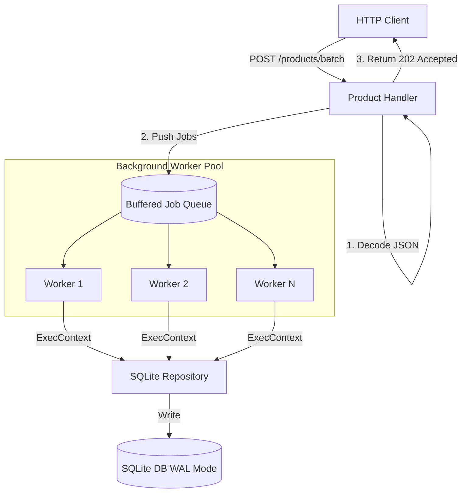

# 🚀 Production-Grade Golang REST API

[](https://golang.org/)
[](https://blog.cleancoder.com/uncle-bob/2012/08/13/the-clean-architecture.html)
[](http://localhost:8080/metrics)
[](http://localhost:8080/swagger/index.html)

This is not just a CRUD API—it is an **Engineering Showcase** of a resilient, highly concurrent, and observable microservice built with Go. It demonstrates how to handle high-throughput background processing, maintain system stability under load, and provide deep visibility into service health.

---

## 🏗️ Core Engineering Pillars

### 1. **High-Performance Concurrency (Worker Pool Pattern)**
Go's goroutines are powerful, but unbounded concurrency leads to resource exhaustion. This service implements a managed **Worker Pool** (`pkg/worker/pool.go`):
- **Asynchronous Batching:** The `POST /products/batch` endpoint offloads heavy DB write operations to a background pool and immediately returns `202 Accepted` to the client.
- **Backpressure Management:** A buffered job queue ensures that the system doesn't drop requests, while a fixed number of workers prevents the database from being overwhelmed.
- **Resilient SQLite:** Configured with **WAL Mode** and **Busy Timeouts** to support high-concurrency writes without "database locked" errors.

### 2. **Observability & Monitoring (Golden Signals)**
A production service is a black box without metrics. This API exposes:
- **📊 Prometheus Metrics:** Real-time tracking of request duration (histograms) and throughput (counters) at `/metrics`.
- **🪵 Structured Logging:** Uses `log/slog` for JSON-formatted logs, including request duration, status codes, and IP addresses for ELK/Loki ingestion.
- **🩺 Health & Readiness:** 
    - `/health`: Liveness probe for orchestrators (K8s).
    - `/ready`: Readiness probe that performs an active `PingContext()` against the database.

### 3. **Resilience & Distributed System Patterns**
- **Context Propagation:** Contexts flow through every layer (Handler -> Service -> Repository). This allows for **Cascading Cancellations**—if a client disconnects, the database query is immediately aborted.
- **Global Timeouts:** Every request is protected by a 60-second timeout middleware to prevent resource leaks.
- **Rate Limiting:** IP-based rate limiting using a token bucket algorithm to prevent abuse and ensure fair resource distribution.
- **Graceful Shutdown:** Handles `SIGTERM/SIGINT` to drain in-flight requests and safely stop the background worker pool before exit. **Zero data loss.**

---

## 🏛️ Architecture
The project follows **Clean Architecture** and **SOLID** principles.

### **Request Flow & Concurrency Model**


### **Project Structure**
- **Dependency Injection:** Every layer (Handler, Service, Repository) is decoupled via interfaces, enabling 100% unit test coverage with mocks.
- **Statelessness:** Designed to scale horizontally behind a load balancer.

```text
cmd/server/  - Entry point & Dependency Injection
internal/
  handlers/  - Transport Layer (REST/JSON)
  services/  - Business Logic & Orchestration
  repository/- Persistence Layer (SQLite Interface)
pkg/
  worker/    - Generic Concurrency Worker Pool
  middleware/- Cross-cutting concerns (Metrics, Rate Limiting, Logging)
```

---

## 🚦 Getting Started

### 1. Build & Test
```bash
# Run the test suite
go test ./... -v

# Generate API Documentation
swag init -g cmd/server/main.go
```

### 2. Run Locally
```bash
go run cmd/server/main.go
```

The server starts on `:8080` with the following key endpoints:
- 📖 **Swagger UI:** `http://localhost:8080/swagger/index.html`
- 📊 **Metrics:** `http://localhost:8080/metrics`
- 🩺 **Health:** `http://localhost:8080/health`
- 🧪 **Readiness:** `http://localhost:8080/ready`

---

## 🧪 Testing the Concurrency
Witness the background worker pool in action:
```bash
curl -X POST -H "Content-Type: application/json" -d '[
  {"name": "Espresso", "price": 2.50},
  {"name": "Latte", "price": 4.00},
  {"name": "Cappuccino", "price": 3.50}
]' http://localhost:8080/products/batch
```
**Response:** `202 Accepted` (Worker pool takes over from here! Check your logs to see it working.)

---

## 🔍 Technical Implementation Highlights

### **1. Concurrency: The Worker Pool**
We avoid spawning "fire-and-forget" goroutines per request. Instead, we use a controlled pool:
```go
// pkg/worker/pool.go
func (p *Pool) Start(ctx context.Context) {
    for i := 0; i < p.workerCount; i++ {
        go func(id int) {
            for {
                select {
                case job := <-p.jobQueue:
                    job(ctx)
                case <-ctx.Done():
                    return
                }
            }
        }(i)
    }
}
```

### **2. Resilience: Context Propagation**
Contexts flow from the HTTP request into the database layer to ensure queries are cancelled if the client disconnects:
```go
// internal/repository/sqlite_product_repository.go
func (r *SQLiteProductRepository) Create(ctx context.Context, p *models.Product) error {
    query := `INSERT INTO products (name, price) VALUES (?, ?)`
    _, err := r.db.ExecContext(ctx, query, p.Name, p.Price)
    return err
}
```

### **3. Reliability: Graceful Shutdown**
The application ensures that all in-flight jobs in the worker pool are finished before the process exits:
```go
// cmd/server/main.go
case sig := <-shutdown:
    slog.Info("Starting graceful shutdown", "signal", sig)
    
    // 1. Stop accepting new HTTP requests
    srv.Shutdown(shutdownCtx)
    
    // 2. Drain and stop the worker pool
    cancel() // Cancel context to stop idle workers
    workerPool.Stop() // Wait for active jobs to finish
```

---
*Built with ❤️ and Go 1.23*
